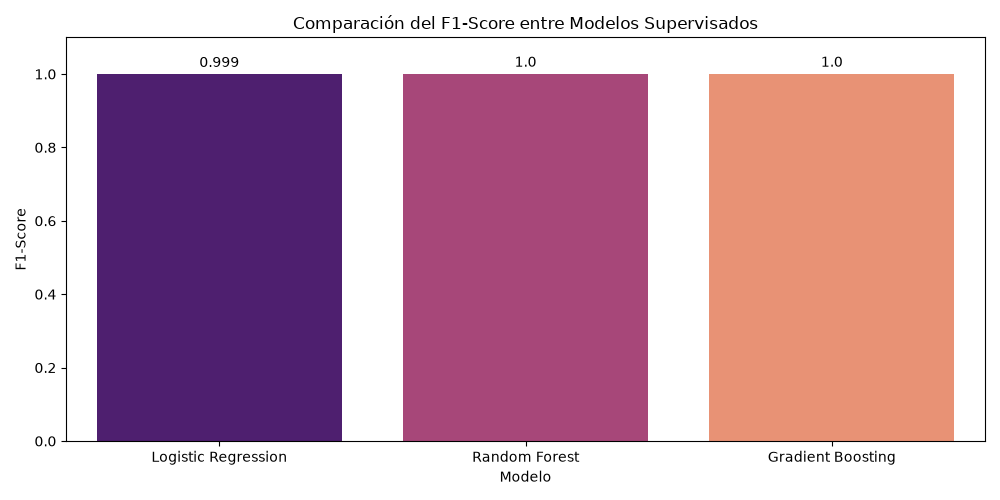
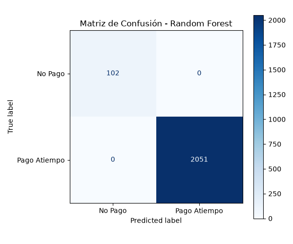
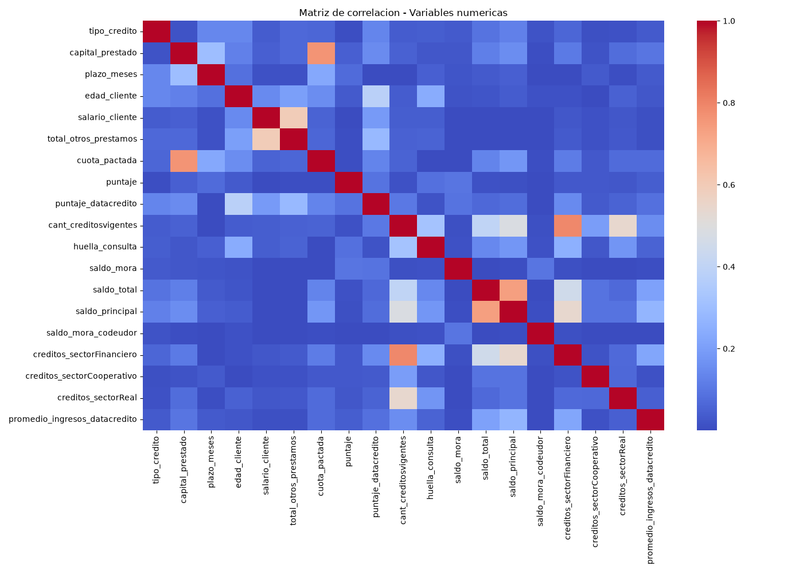

# PIM5 - Scoring crediticio y monitoreo de data drift

## Descripción del proyecto

Este proyecto desarrolla un flujo de machine learning aplicado a scoring crediticio. El objetivo principal es predecir si un cliente pagará a tiempo, utilizando como variable objetivo `Pago_atiempo`.

Además del entrenamiento y evaluación de modelos, el proyecto incorpora una etapa de monitoreo para detectar posibles cambios en la población de datos, conocidos como data drift, que podrían afectar el desempeño del modelo en el tiempo.

## Caso de negocio

El caso simula una solución analítica para una entidad que necesita anticipar el comportamiento de pago de sus clientes. A partir de variables financieras, laborales y crediticias, se busca construir un modelo capaz de apoyar decisiones relacionadas con riesgo crediticio.

El monitoreo posterior permite identificar si los datos actuales comienzan a diferenciarse de los datos históricos utilizados como referencia, lo cual puede indicar la necesidad de revisar variables, ajustar el modelo o realizar un nuevo entrenamiento.

## Estructura del proyecto

```text
PIM5/
├── src/
│   ├── cargar_datos.py
│   ├── ft_engineering.py
│   ├── model_training_evaluation.py
│   └── model_monitoring.py
├── Base_de_datos.xlsx
├── comparacion_modelos.png
├── requirements.txt
└── README.md
```

## Dataset

El archivo utilizado es Base_de_datos.xlsx.
La variable objetivo es:
Pago_atiempo
Donde:
1 representa pago a tiempo.
0 representa no pago a tiempo.
El dataset contiene variables relacionadas con:
Tipo de crédito.
Capital prestado.
Plazo del préstamo.
Edad del cliente.
Tipo laboral.
Salario.
Puntajes crediticios.
Saldos.
Mora.
Créditos vigentes.
Tendencia de ingresos.
Flujo de trabajo
El proyecto se organizó en las siguientes etapas:
Carga de datos desde archivo Excel.
Exploración inicial del dataset.
Separación entre variables predictoras y variable objetivo.
Identificación de variables numéricas y categóricas.
Creación de pipelines de preprocesamiento.
Imputación de valores faltantes.
Escalado de variables numéricas.
Codificación de variables categóricas.
División del dataset en entrenamiento y prueba.
Entrenamiento de modelos supervisados.
Evaluación mediante métricas de clasificación.
Monitoreo de data drift mediante Streamlit.
Feature engineering
El archivo src/ft_engineering.py contiene el proceso de preparación de datos.
En este archivo se realiza:
Carga del dataset.
Separación de X e y.
Identificación de columnas numéricas y categóricas.
Imputación de nulos.
Escalado con StandardScaler.
Codificación con OneHotEncoder.
División train/test.
Retorno de los datos procesados para entrenamiento.
Modelos entrenados
El archivo src/model_training_evaluation.py entrena y evalúa distintos modelos de clasificación:
Logistic Regression.
Random Forest.
Gradient Boosting.
Las métricas utilizadas fueron:
Accuracy.
Precision.
Recall.
F1-Score.
También se generó un gráfico comparativo de desempeño entre modelos.
Monitoreo de modelo y data drift
El archivo src/model_monitoring.py contiene una aplicación desarrollada en Streamlit para monitorear cambios entre una población histórica de referencia y una población actual.
La aplicación permite:
Visualizar registros de referencia y registros actuales.
Generar predicciones del modelo sobre datos actuales.
Mostrar métricas de desempeño del modelo.
Comparar distribuciones históricas vs actuales.
Calcular métricas de data drift.
Visualizar semáforos de riesgo.
Analizar evolución temporal del drift.
Generar recomendaciones automáticas.
Métricas de data drift utilizadas
Se implementaron las siguientes métricas:
Kolmogorov-Smirnov test para variables numéricas.
Population Stability Index, PSI.
Jensen-Shannon divergence.
Chi-cuadrado para variables categóricas.
Estas métricas permiten identificar si la distribución de las variables actuales cambió respecto a la población histórica.

## Aplicación en Streamlit
Para ejecutar la aplicación:
python -m streamlit run .\src\model_monitoring.py
La aplicación se abre localmente en:
http://localhost:8501

Instalación de dependencias
Para instalar las librerías necesarias:
pip install -r requirements.txt

Principales librerías utilizadas:
pandas
numpy
scikit-learn
matplotlib
seaborn
streamlit
plotly
scipy
openpyxl

## Hallazgos principales
Durante el desarrollo se observó que los modelos alcanzan métricas muy altas. Esto puede indicar que el dataset es altamente separable, aunque también requiere precaución porque podría existir fuga de información.



En el monitoreo de drift se comparó una población histórica con una población actual y se identificaron variables con diferentes niveles de riesgo. En particular, la aplicación permite detectar variables con drift alto para recomendar revisión de datos, análisis de estabilidad o posible reentrenamiento del modelo.

## Observaciones importantes
Las métricas perfectas del modelo deben interpretarse con cautela, ya que pueden indicar un dataset altamente separable o posible fuga de información.
El monitoreo de data drift no reemplaza la evaluación del modelo, sino que complementa el ciclo de machine learning permitiendo detectar cambios en los datos que podrían afectar el rendimiento futuro.

## Métricas Atípicas T
anto Random Forest como Gradient Boosting alcanzaron un rendimiento del 100% ($1.0$ de F1-Score) en el conjunto de testeo, mientras que la Regresión Logística se situó en un $0.999$.
En condiciones reales, una precisión perfecta en múltiples modelos complejos suele ser un síntoma inequívoco de Data Leakage. Es altamente probable que el proceso de ingeniería de características (ft_engineering.py) esté incluyendo alguna variable predictora que contiene información directa o indirecta del resultado final del target (Pago_atiempo).

Un aspecto a tener en cuenta es la distribución del Target, el dataset presenta un severo desbalance de clases, donde aproximadamente el 95.2% de las observaciones corresponden a clientes que pagaron a tiempo (Pago Atiempo: 2051 casos en test) frente a un escaso 4.8% de clientes morosos (No Pago: 102 casos en test).Impacto en la Evaluación: Aunque las matrices de confusión muestran que los modelos clasifican correctamente la clase minoritaria sin falsos positivos ni falsos negativos, la asimetría de los datos exige un monitoreo constante mediante métricas de precisión-recall, evitando guiarse únicamente por el Accuracy general.

#### Matrices de Confusión por Modelo:
| Logistic Regression | Random Forest | Gradient Boosting |
| :---: | :---: | :---: |
|  |  |  |

## Independencia Lineal Certificada



El análisis previo mediante la matriz de correlación de Pearson y el Factor de Inflación de la Varianza (VIF) confirmó que no existen problemas de multicolinealidad severa (todas las variables se mantuvieron con un $\text{VIF} < 5$ y correlaciones lineales $< 0.80$).
Al observar el mapa de calor generado (matriz_correlacion_multicolinealidad.png), se identifican agrupaciones lógicas de correlación moderada que son sanas para el modelo, tales como:

    cuota_pactada con capital_prestado.
    salario_cliente con total_otros_prestamos.
    Los distintos tipos de saldos entre sí (saldo_total y saldo_principal).

## Despliegue y Containerización

El proyecto ha sido containerizado utilizando Docker para garantizar la reproducibilidad del entorno en cualquier sistema.Creé un Dockerfile basado en python:3.10-slim para optimizar el tamaño de la imagen y asegurar la compatibilidad con las librerías modernas de Data Science.

También apliqué gestión de dependencias realizando una depuración exhaustiva del archivo requirements.txt, eliminando dependencias innecesarias de desarrollo para asegurar una instalación limpia y estable en el contenedor.

La API, construida con FastAPI, se sirve a través de Uvicorn, configurado para ejecutarse dentro del contenedor exponiendo el puerto 8000.

Instrucciones de Ejecución:

Construir la imagen: docker build -t api-prediccion .

Ejecutar el contenedor: docker run -p 8000:8000 api-prediccion

Acceder a la documentación interactiva (Swagger) en: http://127.0.0.1:8000/docs